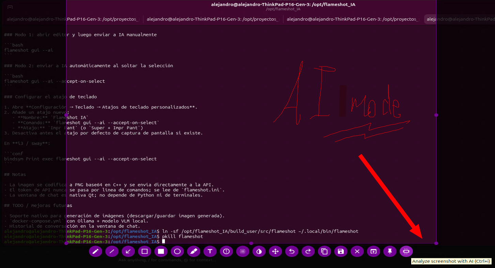
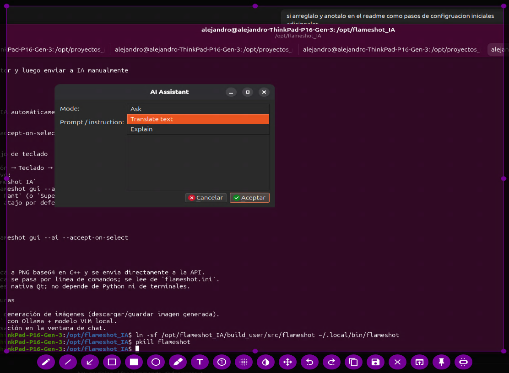
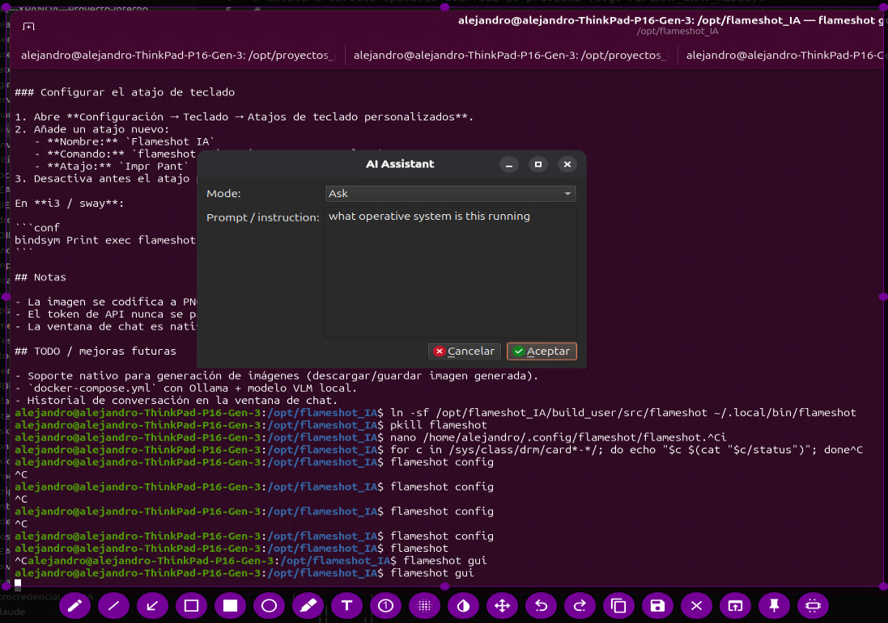
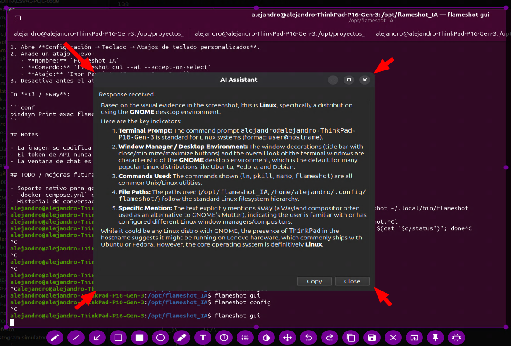

# Flameshot IA

> **This is a fork of [Flameshot](https://github.com/flameshot-org/flameshot).**
> The original project and its documentation live upstream. You can read the
> original README at <https://github.com/flameshot-org/flameshot#readme>.
> All credit for the base application goes to the Flameshot authors and
> contributors. This fork only adds the AI features described below.

Basically, you ask the linked VLM about the image (question, explanation, translation...) and it replies in a modal, all through a new button in the native Flameshot UI:









Fork of [Flameshot](https://github.com/flameshot-org/flameshot) with an **AI** button natively integrated in C++/Qt. After each capture it shows a **native Qt dialog** to:

- **Ask** a vision model (VLM) freely.
- **Translate** the text visible in the screenshot.
- **Explain** the screen content.

> **Future TODO:** generate/edit a new image from the capture (Qwen-edit, etc.).

API calls are made directly from C++ with `QNetworkAccessManager`, using the OpenAI Chat Completions format. It works with:

- OpenAI / Azure OpenAI services.
- vLLM, TGI, LM Studio, Ollama, etc., exposed with `/v1/chat/completions`.
- Any endpoint that accepts `image_url` in base64.

## Structure

```text
/opt/flameshot_IA
├── src/
│   ├── tools/ai/              # AI button/tool
│   ├── utils/openaiclient.*   # OpenAI client in C++
│   ├── widgets/ai/            # Native Qt dialog and chat window
│   └── core/flameshot.cpp     # Integration with the capture flow
├── README.md                  # This file (fork README)
├── build.sh                   # Docker build script
└── install.sh                 # Quick installation
```

## Requirements

- Docker (recommended) or an Ubuntu/Debian system with:
  - `cmake`, `g++`
  - `qt6-base-dev`, `qt6-tools-dev`, `qt6-svg-dev`, `qt6-base-private-dev`
  - X11/Wayland libraries (see `build.sh`)

## Quick installation

```bash
cd /opt/flameshot_IA
./install.sh
```

This builds Flameshot with Docker and creates the `~/.local/bin/flameshot` and
`~/.local/bin/flameshot-ia` symlinks pointing to the fork binary.

## Initial configuration steps (important)

If running `flameshot` opens the **normal** Flameshot instead of the IA fork, or
the **AI** button does not show up, check these points:

### 1. Make sure `flameshot` points to the fork, not the system one

```bash
which flameshot
# Should return: /home/<user>/.local/bin/flameshot
```

If it returns `/usr/bin/flameshot`, then `~/.local/bin` is not ahead of the
`PATH` or the symlink does not exist. Fix:

```bash
ln -sf /opt/flameshot_IA/build_user/src/flameshot ~/.local/bin/flameshot
```

Make sure `~/.local/bin` comes before `/usr/bin` in `PATH`
(in `~/.bashrc`/`~/.profile`: `export PATH="$HOME/.local/bin:$PATH"`).

### 2. Enable AI in `flameshot.ini`

The AI button is **hidden by default** (`iaEnabled=false`). Without these keys in
`~/.config/flameshot/flameshot.ini`, the fork behaves like normal Flameshot:

```ini
[General]
iaEnabled=true
iaApiUrl=http://localhost:8000/v1/chat/completions
iaApiToken=                                # Bearer token (optional)
iaModel=cpatonn/Qwen3-VL-32B-Instruct-AWQ-4bit
iaDefaultMode=ask
iaCopyResult=true
iaShowDialog=true

[Shortcuts]
TYPE_AI=Ctrl+I
```

You can also enable it from the GUI with `flameshot config` → **General** tab →
**"AI Integration (Flameshot IA)"** section.

### 3. Verify

```bash
which flameshot                 # should be ~/.local/bin/flameshot
flameshot --version             # Flameshot v14.x
flameshot gui                   # should show the AI button (chip icon)
```

## Manual build

### With Docker (recommended)

```bash
cd /opt/flameshot_IA
./build.sh
```

The resulting binary will be at `build_user/src/flameshot`.

### Without Docker (Ubuntu/Debian)

```bash
sudo apt install -y cmake g++ qt6-base-dev qt6-tools-dev qt6-svg-dev \
  qt6-base-private-dev libgl1-mesa-dev libxkbcommon-x11-dev libxcb-util-dev \
  libxcb-cursor-dev libxcb-keysyms1-dev libxcb-xfixes0-dev libxcb-shape0-dev \
  libxcb-randr0-dev libxcb-image0-dev libxcb-xinerama0-dev libxcb-icccm4-dev \
  libxcb-sync-dev libxcb-xkb-dev libxcb-render-util0-dev libxcb-util0-dev \
  libdbus-1-dev

mkdir build && cd build
cmake .. -DCMAKE_BUILD_TYPE=Release
make -j$(nproc)
```

## Configuring Flameshot

The AI options are read from `flameshot.ini`.

**Location on Linux:**

```text
~/.config/flameshot/flameshot.ini
```

### Option 1: from the graphical interface

Open the Flameshot settings:

```bash
flameshot config
```

In the **General** tab, look for the **"AI Integration (Flameshot IA)"** section and fill in:

- **Enable AI button and backend**
- **API URL**
- **API Token** (Bearer, optional)
- **Model**
- **Default mode** (Ask / Translate / Explain)
- **Show mode/prompt dialog before sending**
- **Copy text result to clipboard on close**

### Option 2: edit `flameshot.ini` by hand

Example configuration:

```ini
[General]
iaEnabled=true
iaApiUrl=http://localhost:8000/v1/chat/completions
iaApiToken=                                # Bearer token (optional)
iaModel=cpatonn/Qwen3-VL-32B-Instruct-AWQ-4bit
iaDefaultMode=ask
iaCopyResult=true
iaShowDialog=true

[Shortcuts]
TYPE_AI=Ctrl+I
```

## Usage

1. Launch Flameshot IA:
   ```bash
   flameshot gui
   # or directly:
   /opt/flameshot_IA/build_user/src/flameshot gui
   ```
2. Take a screenshot.
3. Click the **AI** button (chip icon) or press `Ctrl+I`.
4. The **native Flameshot IA dialog** appears: choose a mode and type the prompt.
5. The chat window opens, the image is sent to the model and, once the reply arrives, it is shown in the same widget. You can copy it to the clipboard with the **Copy** button.

## Binding Print Screen to Flameshot IA

The fork adds the `--ai` option to `flameshot gui`. This marks the capture so that, when accepted, it is sent to the AI.

### Mode 1: open the editor and then send to AI manually

```bash
flameshot gui --ai
```

### Mode 2: send to AI automatically when the selection is released

```bash
flameshot gui --ai --accept-on-select
```

### Configure the keyboard shortcut

1. Open **Settings → Keyboard → Custom keyboard shortcuts**.
2. Add a new shortcut:
   - **Name:** `Flameshot IA`
   - **Command:** `flameshot gui --ai --accept-on-select`
   - **Shortcut:** `Print Screen` (or `Super + Print Screen`)
3. Disable the default screenshot shortcut first, if one exists.

On **i3 / sway**:

```conf
bindsym Print exec flameshot gui --ai --accept-on-select
```

## Notes

- The image is encoded to PNG base64 in C++ and sent directly to the API.
- The API token is never passed on the command line; it is read from `flameshot.ini`.
- The chat window is native Qt; it does not depend on Python or terminals.

## TODO / future improvements

- Native support for image generation (download/save the generated image).
- `docker-compose.yml` with Ollama + a local VLM model.
- Conversation history in the chat window.
